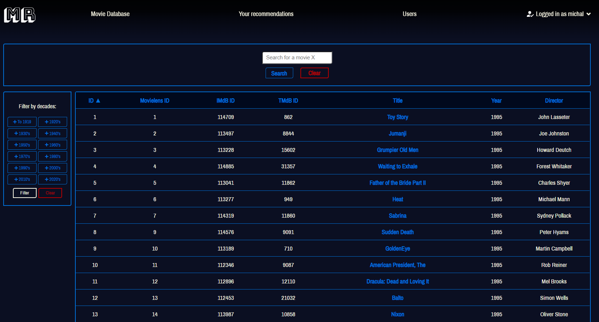
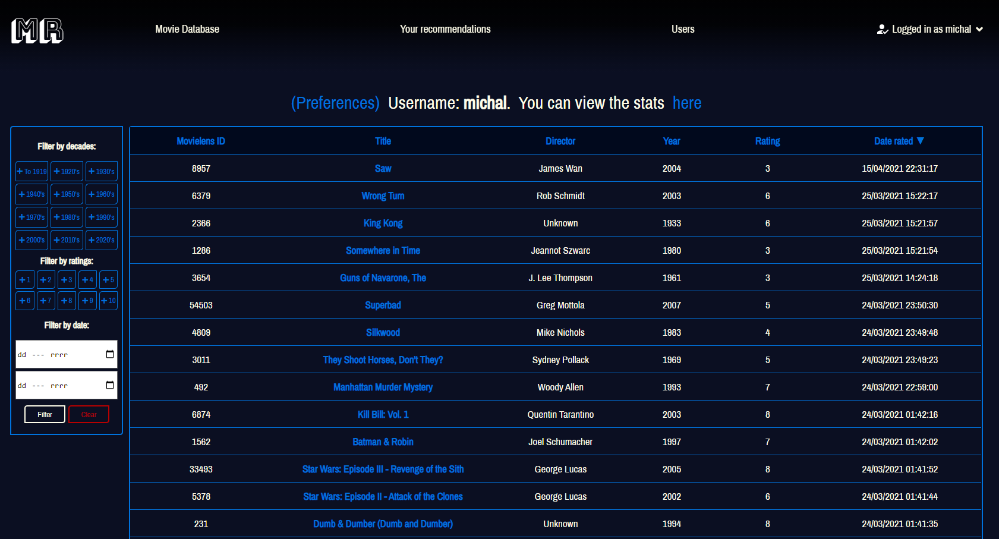
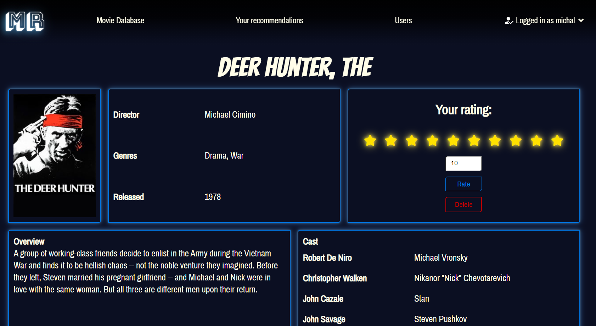
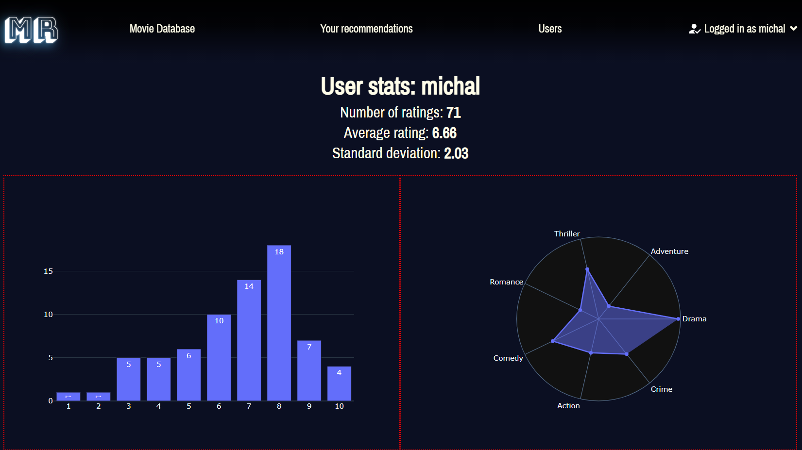

# < Work in progress >

## Introduction
The idea for this project came from my master's thesis, which focused on movie recommendation algorithms. Having implemented a command line system, which allowed the users to rate the movies, and receive recommendations, I thought it will be fun to do it in a more user-friendly way, in a form of a web application

## Technologies
* Python 3.x
* Django 3.x
* HTML
* CSS
* NumPy
## Installation
1. Inside *mysite/static/* directory, create new folder, called 'private'. Inside this newly created folder, create a new file, called 'passes.json'. This file should be structured like: 
{"key":*\<key>*,"email":*\<email>*:,"password":*\<password>*}, where:
* *\<key>* is Django's [secret key](https://docs.djangoproject.com/en/3.1/ref/settings/#std:setting-SECRET_KEY)
* *\<email>* is your email address
* *\<password>* is your email password (or your [application password](https://support.google.com/accounts/answer/185833?hl=pl)).
(Unless you want to test the password reset functionality, *\<email>* and *\<password>* may contain completly bogus information).
2. Install required dependencies, by running:
```
python install -r requirements.txt
```
## Functionalities
* User authentication:
    * Registration
    * Logging in
    * Password reset via email
* All movies are displayed, they can be sorted by each column, and filtered by decades
* Searching movies by the title:


* A user can view all of his/her rated movies, and sort them, or filter them by decade, rating, or date:


* A user can add, update, and remove rating for a movie:


* Movie overviews and posters are loaded from TMDb, using [TMDb API](https://developers.themoviedb.org/3/getting-started/introduction)
* A user can view information about his/her ratings:




 

## Todos 
* More tests
* Enhance recommendation algorithm by using collaborative filltering
* Run recommendations in the background
* More detailed user stats (display most similar users with links to their profiles)
* Prettier CSS